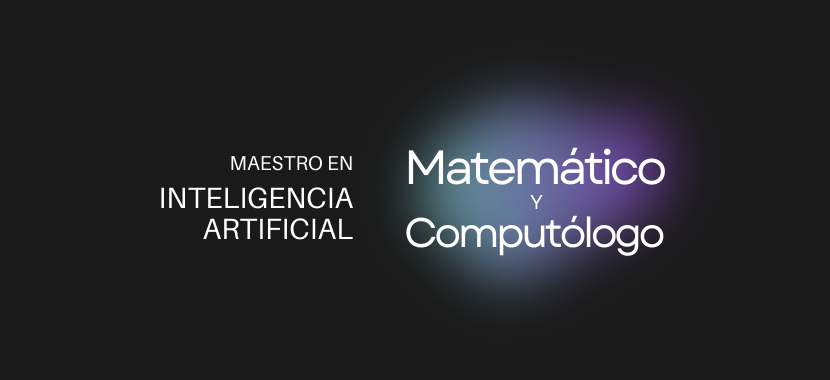

# ¡Hola Mundo! Soy un `Dev` del Estado de México 😊

### Actualmente trabajo en [DevMatch](https://dev-match.netlify.app) como líder del Frontend.

---

### Algunas Páginas Web

- [Ecommerce con WP](https://catrinerias.com)

- [Página fullstack con React y Firebase](https://multipisosyazulejos.com)

- [Landing Page de un Freelancer](https://luisdur8.github.io/freelancer)

- [Página simple sobre las Rutas para ser Desarrollador/a Web](https://luisdur8.github.io/TS-Rutas)

### Creaciones en Organizaciones

- [Notas para un Taller FullStack](https://github.com/desarrolladoresTH/BootCamp-FullStack)

---

Analítico │ Programador │ Desarrollador Web │ Líder de Proyectos │ Educador y Divulgador

---

> **Habilidades Tecnológicas**
>
> Git/GitHub, HTML, CSS, Bootstrap, Tailwind, Diseño y Desarrollo Responsive, JavaScript, TypeScript, React, Astro, Json, SQL, Python, Java, C, Markdown, Wordpress, Terminal de Comandos, Trello, VS Code, Emmet, Scrum, Kanban, Atomic Desing, Colaboratory, Office e Inglés Técnico.

---

### Contáctame

- [Email](mailto:luisloher.dev@gmail.com)

- [LinkedIn](https://www.linkedin.com/in/luis-loher-web-developer)
